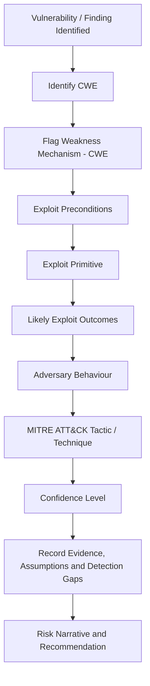

### hello!

## Vulnerabiltiy → Attack Path Workflow

I use a structured, evidence-led process to translate software weaknesses into attacker behaviour. Rather than mapping Common Weakness Enumerations directly to MITRE ATT&CK tactics, I evaluate the vulnerability context, the exploit capability it creates, and the likely adversary actions that could follow. This creates a more defensible link between vulnerability management, threat modelling, exposure management, and operational detection.



### Process Summary

| Step | Activity | Output |
|---:|---|---|
| 1 | Identify the vulnerability | CVE, internal finding ID, affected asset |
| 2 | CWE | Weakness classification |
| 3 | Understand the weakness mechanism | Plain-language description of what is broken |
| 4 | Define exploit preconditions | Exposure, authentication, privilege, user interaction |
| 5 | Identify the exploit primitive | RCE, auth bypass, file read, credential exposure, SSRF |
| 6 | Assess exploit outcomes | What the attacker could realistically achieve |
| 7 | Translate to adversary behaviour | What the attacker would do during an intrusion |
| 8 | Map to MITRE ATT&CK | Relevant tactic and technique |
| 9 | Score confidence | High, medium, or low confidence based on evidence |
| 10 | Record evidence and assumptions | Audit trail for the mapping |
| 11 | Identify detection gaps | Logs, telemetry, alerts, visibility gaps |
| 12 | Produce recommendation | Remediation, compensating controls, ownership |

### Core Model

```text
CWE = Weakness definition
Exploit primitive = what capability the attacker gains
Exploit outcome = the risk / what the attacker can achieve
MITRE ATT&CK = how that behaviour appears in an intrusion
```

### Example Mapping

| CWE | Exploit Primitive | Exploit Outcome | ATT&CK Interpretation |
|---|---|---|---|
| CWE-89 SQL Injection | Query manipulation | Credential extraction or database dumping | Credential Access / Collection / Exfiltration |
| CWE-918 SSRF | Server-side request manipulation | Cloud metadata access or internal service probing | Discovery / Credential Access |
| CWE-22 Path Traversal | Arbitrary file read | Secret, config, or key exposure | Credential Access / Collection |
| CWE-78 Command Injection | Command execution | Remote shell or system compromise | Initial Access / Execution / Persistence |
| CWE-798 Hardcoded Credentials | Credential exposure | Use of valid accounts | Credential Access / Initial Access / Lateral Movement |

### Analyst Rule

Never map CWE directly to ATT&CK without context.

```text
CWE → Exploit Primitive → Exploit Outcome → Adversary Behaviour → ATT&CK Technique
```

---

It is a **tool for defensive scanning**.

### How it works

A deterministic, code-orchestrated pipeline works using an LLM of choice:

1. **Triage** — risk scoring, refined by a cheap model.
2. **Discovery** — recall-biased finding per file in code.
3. **Validation** — re-examines each candidate with context, builds the full
   CWE → primitive → outcome → adversary → ATT&CK chain, and enforces a hard
   evidence gate (precondition + reachability + ≥1 verbatim citation).
4. **Critic** — a bounded adversarial loop that confirms, downgrades, or
   rejects each finding.
5. **Dedupe** — clusters overlapping findings.
6. **Synthesis** — assembles the report; sub-threshold and rejected findings
   are kept in a transparency appendix.
